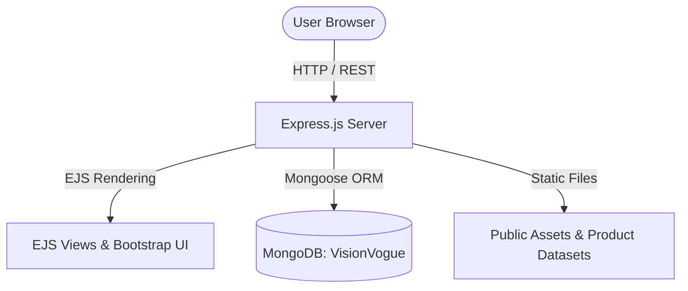

<div align="center">

# 👓 VisionVogue
### *Luxury Eyewear, Sunglasses & Contact Lens E-Commerce Platform*

[](https://nodejs.org/)
[](https://expressjs.com/)
[](https://www.mongodb.com/)
[](https://getbootstrap.com/)
[](LICENSE)

[Live Demo](http://localhost:5000) · [Report Bug](https://github.com/Rohitsuryawanshi19/VisionVogue-E-Commerce-Website/issues) · [Request Feature](https://github.com/Rohitsuryawanshi19/VisionVogue-E-Commerce-Website/issues)

</div>

---

## 📖 Overview

**VisionVogue** is a flagship full-stack luxury e-commerce application designed for premium optical products. Built with **Node.js, Express.js, EJS, and MongoDB**, VisionVogue delivers a seamless shopping experience for Eyeglasses, Sunglasses, Contact Lenses, and Special Power Lenses.

Inspired by top global e-commerce platforms like **Lenskart** and **Flipkart**, VisionVogue integrates real-time order lifecycle automation, dynamic 5-minute countdown UPI QR code payments, custom 3D contact lens packaging artwork, an optical prescription vault, and an AI-powered Virtual Try-On scanner.

---

## ✨ Core Features & Highlights

### 🛒 1. Catalog & Product Experience
- **1,300+ Product Catalog**: Pre-seeded dataset featuring real optical product photography, multi-angle gallery views, and verified customer review photos.
- **Categorized Mega-Menu**: Instant navigation for **Eyeglasses**, **Sunglasses**, **Contact Lenses**, **Men's Collection**, and **Special Power Lenses**.
- **Contact Lens 3D Packaging**: Custom 3D package artwork for CooperVision, Bausch & Lomb, and Johnson & Johnson (Acuvue Moist, Acuvue Oasys, Lacelle Color, BioTrue).
- **Auto-Banner Slideshow**: Seamless 4-second hero carousel showcasing seasonal collections.

### 💳 2. Real-Time Order & Payment Engine
- **Dynamic UPI QR Code Generator**: Generates real-time UPI payment QR codes (`upi://pay?pa=visionvogue@upi`) pre-filled with the exact subtotal.
- **5-Minute Countdown Session Lock**: Active countdown clock (`05:00` → `00:00`) with automatic session expiry if unpaid.
- **Interactive Credit Card Preview**: Live 3D card preview updating cardholder name, card number, and expiry date in real-time.
- **Automated Lifecycle Fulfillment**: Real-time order progress tracking through stages: `Order Placed` ➔ `Optical Lab` ➔ `In Transit` ➔ `Delivered`.

### 👤 3. Account Dashboard & Rx Vault (`/auth/profile`)
- **Vogue Rewards Program**: Earn and redeem reward points on every checkout.
- **Saved Prescription Vault**: Store and manage OD/OS SPH, CYL, AXIS, and PD prescription parameters.
- **Live Order Timeline**: Track fulfillment progress with visual milestone progress bars.
- **1-Click VIP Demo Login**: Instant login shortcut for quick demo testing.

### 🕶️ 4. Virtual Try-On & Support System
- **AI Virtual Try-On (`/virtual-try-on`)**: Interactive photo upload with laser scan animation and frame shape recommendations.
- **Support Hub (`/support/*`)**: Integrated portal for Track Order, Returns & Exchanges, Shipping Policy, and Store Finder.
- **Admin Dashboard (`/admin`)**: Real-time sales metrics, revenue analytics, stock alerts, and order management.

---

## 🛠️ Architecture & Tech Stack



| Layer | Technologies Used |
| :--- | :--- |
| **Backend Framework** | Node.js (v18+), Express.js (v4.18) |
| **Database & ORM** | MongoDB (`mongodb://127.0.0.1:27017/VisionVogue`), Mongoose (v8.1) |
| **Frontend & UI** | EJS (Embedded JavaScript), Bootstrap 5.3, Vanilla CSS3, FontAwesome 6 |
| **Animations** | GSAP 3.12, ScrollTrigger |
| **Security & Session** | bcryptjs, express-session, dotenv |

---

## 🚦 API Route Reference

| Route Endpoint | Method | Description |
| :--- | :--- | :--- |
| `/` | `GET` | Homepage with hero slider, category grid & new arrivals |
| `/products` | `GET` | Complete product catalog with filters (shape, price, gender) |
| `/products/category/:category` | `GET` | Filtered product catalog by category |
| `/products/:id` | `GET` | Detailed product view with lens upgrades & prescription form |
| `/cart` | `GET / POST` | Shopping cart bag & item quantity updates |
| `/checkout` | `GET / POST` | Payment page with UPI QR code generator & 5-min timer |
| `/auth/profile` | `GET` | Account dashboard, reward points & optical Rx vault |
| `/support/track-order` | `GET / POST` | Real-time order lifecycle tracking portal |
| `/admin` | `GET` | Admin analytics, inventory stock & order management |

---

## 💻 Installation & Local Setup

### 1. Prerequisites
Ensure you have the following installed on your machine:
- **Node.js** (v18.0.0 or higher)
- **MongoDB Server** running locally on port `27017`

### 2. Install Dependencies
```bash
npm install
```

### 3. Configure Environment Variables (`.env`)
Create a `.env` file in the root project directory:
```env
PORT=5000
MONGODB_URI=mongodb://127.0.0.1:27017/VisionVogue
SESSION_SECRET=visionvogue_luxury_eyewear_secret_2026
```

### 4. Launch Dev Server
```bash
node app.js
```

Visit **`http://localhost:5000`** in your browser.

---

## 👨‍💻 Author

Developed with ❤️ by **Rohit Suryawanshi**
- **GitHub**: [@Rohitsuryawanshi19](https://github.com/Rohitsuryawanshi19)
- **Repository**: [VisionVogue-E-Commerce-Website](https://github.com/Rohitsuryawanshi19/VisionVogue-E-Commerce-Website)

---

## 📄 License

This project is licensed under the [MIT License](LICENSE).
